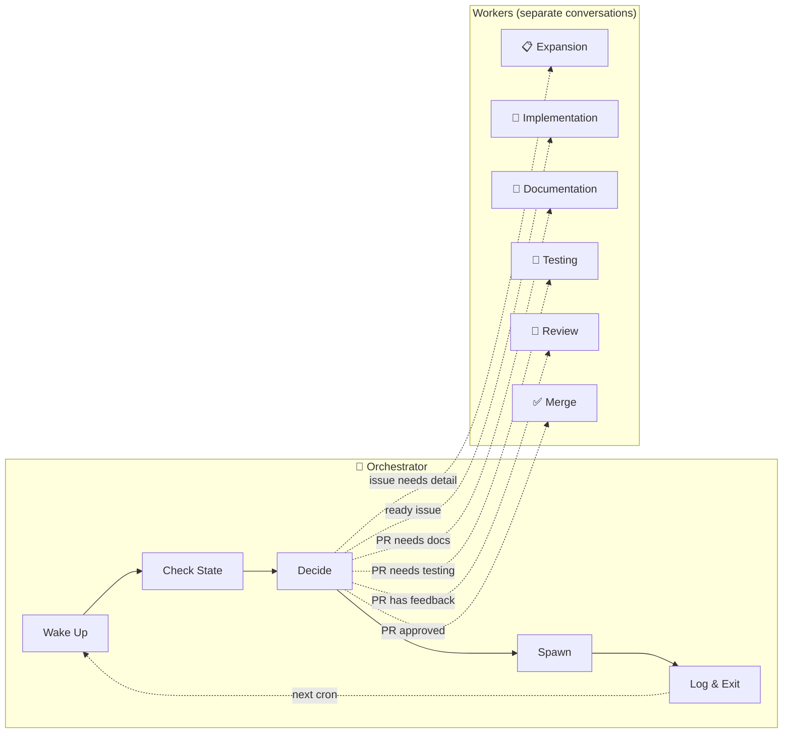
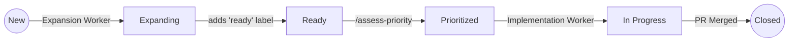
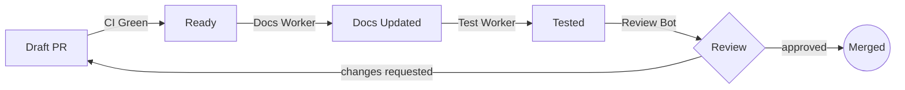

# OHTV Workflow Plugin

Automated PR workflow orchestration for the [ohtv](https://github.com/jpshackelford/ohtv) project. Manages the complete issue-to-merge lifecycle with parallel workers, priority-based scheduling, and documentation-first testing.

## The Circle of Work



The orchestrator wakes every 30 minutes, checks GitHub state, and spawns the appropriate worker. Each worker runs in its own OpenHands conversation and exits when done.

## How It Works

The orchestrator runs on a 30-minute cron schedule. Each wake-up:

1. **Checks for human instructions** in `WORKLOG.md`
2. **Identifies active workers** by querying conversation status
3. **Gathers state** from GitHub (issues, PRs, labels)
4. **Dispatches work** to available slots
5. **Logs status** and exits

### Parallel Worker Model

Two workers can run simultaneously in separate slots:

| Slot | Worker Types | What It Does |
|------|--------------|--------------|
| **Expansion** | `expansion` | Analyzes issues, finds root cause, adds technical detail |
| **PR** | `impl` → `docs` → `test` → `review` → `merge` | Handles code changes (serialized within slot) |

### Issue Lifecycle



> **Labels:** New issues have no `ready` label → Ready issues have technical detail → Prioritized issues have `priority:high/medium/low` labels

### PR Lifecycle



> **Key:** Documentation is updated *before* testing, so testers verify the documented behavior matches reality.

## Key Principles

| Principle | Description |
|-----------|-------------|
| **Documentation First** | README is updated *before* manual testing, so testers verify what's documented |
| **Fire and Forget** | Orchestrator spawns workers but doesn't wait—next wake-up checks new state |
| **One Action Per Wake** | Each orchestrator run does one thing then exits |
| **Priority-Based Work** | Ready issues are scored and highest priority is implemented first |
| **Natural Language** | No special formats—agents read issues, PRs, and reviews naturally |

## Skills Reference

### Issue Phase
| Skill | Trigger | Purpose |
|-------|---------|---------|
| [Expand Issue](skills/expand-issue.md) | `/expand-issue` | Investigate issue, add technical detail, label `ready` |
| [Assess Priority](skills/assess-priority.md) | `/assess-priority` | Score ready issues, assign `priority:*` labels |

### Orchestration
| Skill | Trigger | Purpose |
|-------|---------|---------|
| [Orchestrate](skills/orchestrate.md) | `/orchestrate` | Main decision loop—check state, dispatch workers |
| [Spawn Conversation](skills/spawn-conversation.md) | `/spawn-conversation` | Start OpenHands conversation via API |

### PR Phase
| Skill | Trigger | Purpose |
|-------|---------|---------|
| [PR Workflow Status](skills/pr-workflow-status.md) | `/pr-workflow-status` | Get PR state using `lxa` + `gh` |
| [Manual Test](skills/manual-test.md) | `/manual-test` | Run blackbox tests, post structured results |
| [Prepare and Merge](skills/prepare-and-merge.md) | `/prepare-merge` | Final merge workflow |

### Housekeeping
| Skill | Trigger | Purpose |
|-------|---------|---------|
| [Truncate Worklog](skills/truncate-worklog.md) | `/truncate-worklog` | Archive old entries, keep 6hr context |
| [Disable Automation](skills/disable-automation.md) | `/disable-automation` | Auto-disable on consecutive quiet periods |

## Labels

| Label | Meaning |
|-------|---------|
| `ready` | Issue expanded, has technical detail |
| `priority:critical` | Blocking—do immediately |
| `priority:high` | Important—do soon |
| `priority:medium` | Standard priority |
| `priority:low` | Nice to have |
| `hold` | Don't implement yet (human decision) |
| `blocked` | Waiting on external factors |
| `needs-info` | Need clarification from reporter |

## Setup

### Prerequisites

```bash
# Install lxa (PR dashboard)
uv pip install git+https://github.com/jpshackelford/lxa.git
lxa repo add jpshackelford/ohtv

# Install ohtv (conversation viewer)
uv pip install git+https://github.com/jpshackelford/ohtv.git
```

### Create the Automation

```bash
curl -X POST "https://app.all-hands.dev/api/automation/v1/preset/plugin" \
  -H "Authorization: Bearer $OH_API_KEY" \
  -H "Content-Type: application/json" \
  -d '{
    "name": "OHTV Workflow Orchestrator",
    "plugins": [{
      "source": "github:jpshackelford/.openhands",
      "repo_path": "plugins/ohtv-workflow",
      "ref": "feat/ohtv-workflow-plugin"
    }],
    "prompt": "/orchestrate",
    "trigger": {"type": "cron", "schedule": "*/30 * * * *", "timezone": "America/New_York"},
    "repos": [{"url": "https://github.com/jpshackelford/ohtv"}]
  }'
```

> **Note:** Change `ref` to `main` after the plugin PR is merged.

### Environment Variables

| Variable | Description |
|----------|-------------|
| `OH_API_KEY` | OpenHands API key for spawning conversations |
| `GITHUB_TOKEN` | GitHub token for `gh` CLI operations |

## Auto-Disable Behavior

The orchestrator automatically disables itself after **two consecutive quiet periods** (no work to dispatch). This prevents unnecessary runs when the project is at a natural pause.

**Automation ID:** `c202ca20-60d5-4f5b-9d53-3d7308c1d95b`

To re-enable:
- **UI:** [app.all-hands.dev/automations](https://app.all-hands.dev/automations) → Toggle on
- **API:** `curl -X PATCH ".../api/automation/v1/{id}" -d '{"enabled": true}'`
