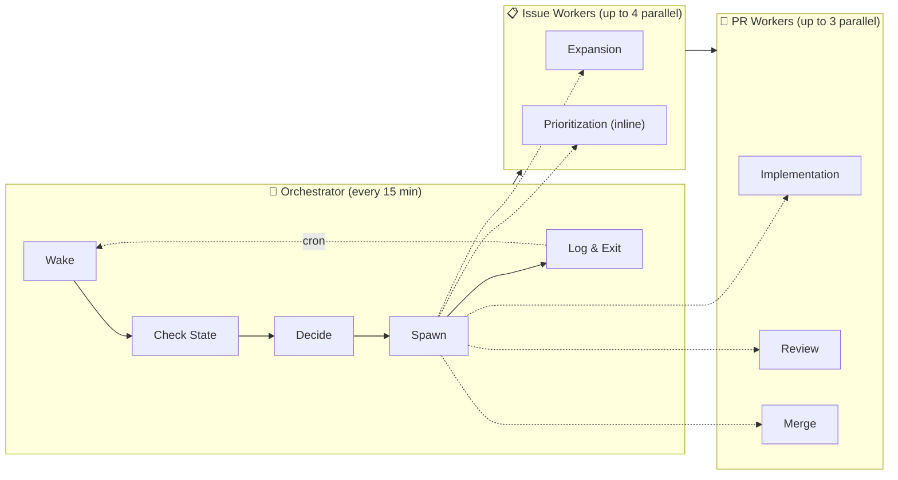
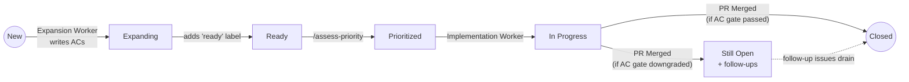
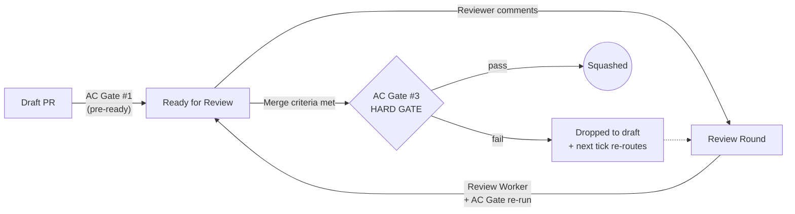
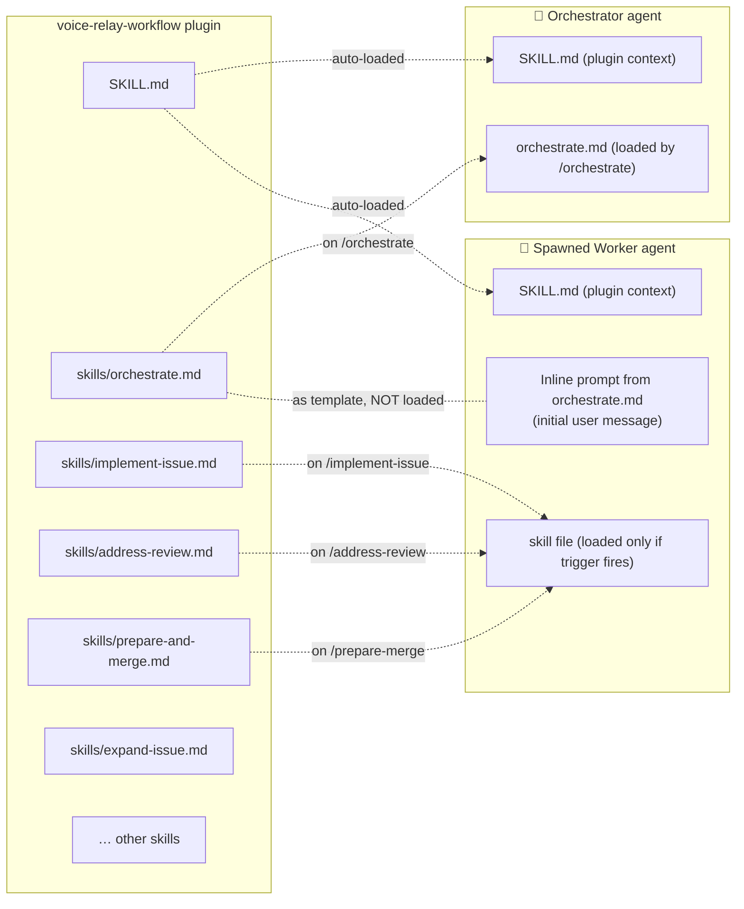

# Voice Relay Workflow Plugin

Automated PR workflow orchestration for the [voice-relay](https://github.com/jpshackelford/voice-relay) project. Drives issues from triage through code, review, and merge — running up to **7 workers in parallel** with priority-based scheduling and a closing-trailer acceptance-criteria gate that keeps merged PRs honest about what they did and didn't deliver.

> Sibling plugins `ohtv-workflow` and `lxa-workflow` share the same orchestration shape; per-project differences (production context, worker mix, gate rules) live in each plugin's `SKILL.md`.

## The Circle of Work



The orchestrator wakes every 15 minutes, checks GitHub state, and spawns the appropriate worker(s). Each worker runs in its own OpenHands conversation and exits when done. The orchestrator never waits for a worker — the next tick will notice when something finished.

## How It Works

Each orchestrator wake-up does five things and exits:

1. **Reads `WORKLOG.md` for human instructions** — any open `## INSTRUCTION:` block is followed before normal work resumes.
2. **Checks which workers are still running** — by querying the OpenHands conversation API; finished workers are removed from `.workflow-state.json`.
3. **Gathers state** from GitHub — open PRs, open issues by label (`ready`, `needs-info`, `priority:*`), and any `hold` labels.
4. **Dispatches work** to whichever slots are free, using the priority table below.
5. **Logs status** to `WORKLOG.md` on `main` (or, on a quiet tick, just bumps a counter in `.workflow-state.json`).

If two consecutive ticks pass with nothing to do, the orchestrator **auto-disables** itself to avoid spinning on an empty backlog. Re-enable it from the OpenHands Cloud UI when you've added new work.

### Parallel Worker Model — 7 slots

Three independent slot pools that can all run at once:

| Slot pool | Max | Workers | What they do |
|---|---|---|---|
| **Expansion** | 4 | `expansion` | Analyze a new issue, find the root cause / pin down requirements, rewrite the body with acceptance criteria, label `ready`. |
| **Implementation** | 1 | `implementation` | Branch from `main`, write code + tests, open a draft PR, run the **AC gate** to decide between `Fixes #N` and `Refs #N` + follow-up issues, move to ready-for-review. |
| **Review** | 2 | `review`, `merge` | `review` addresses each round of feedback and re-runs the AC gate; `merge` is the final hard gate before squash-merging. |

Implementation is serialized to 1 slot because parallel implementations would conflict on branches. Review and expansion can fan out.

### Issue Lifecycle



> **Labels:** New issues have no `ready` label → Ready issues have technical detail + `## Acceptance Criteria` → Prioritized issues have `priority:critical/high/medium/low`. Issues that fail the AC gate at merge stay open until their follow-up issues close.

### PR Lifecycle



> The **Closing-Trailer AC Gate** runs at three checkpoints — pre-ready (implementation worker), after each review round (review worker), and as a hard pre-merge gate (merge worker). If any non-exempt acceptance criterion is uncovered by the diff, the trailer becomes `Refs #N` + filed follow-up issues, never silently `Fixes #N`. See `SKILL.md` for the full rule.

### Post-deploy CI Failures

```mermaid
flowchart LR
    A((Smoke test fails<br/>after deploy)) -->|"auto-file"| B[ci-failure issue]
    B -->|"orchestrator dispatch<br/>(preempts feature work)"| C[fix-ci-failure worker]
    C -->|"increment ci-fix-attempts:N"| D{Classify failure}
    D -->|"real regression"| E[Forward-fix or<br/>revert PR]
    D -->|"flaky test"| F[label flaky-test<br/>+ deflake tracker]
    D -->|"test infra"| G[chore(ci): PR or<br/>needs-human]
    D -->|"deferred dep"| H[temp disable PR<br/>or revert]
    E --> I[Normal PR lifecycle<br/>with AC gate]
    F --> J((Exit))
    G --> J
    H --> I
    I --> J
    J -.->|"attempts < 3"| C
    J -.->|"attempts = 3"| K[Add needs-human<br/>+ remove ci-failure]
```

> CI failures preempt normal feature dispatch — production needs to be unblocked before more changes pile on. The `fix-ci-failure` worker (`/fix-ci-failure`) gets up to **3 attempts** to fix forward or revert; after that it escalates by adding `needs-human` and removing `ci-failure`, so the orchestrator stops re-dispatching and a human takes the wheel.

## Key Principles

| Principle | What it means in practice |
|---|---|
| **Fire and forget** | The orchestrator spawns workers and exits. It never blocks waiting for a worker to finish — the next tick discovers what's done. |
| **One action per wake** | A single tick does one round of dispatching, then exits. Bugs are contained to one cron interval. |
| **Priority-based work** | Ready issues are scored (`priority:*`) and the highest priority goes to the lone implementation slot. Expansion runs on whatever's oldest. |
| **Natural language** | Workers read issues, PRs, and reviews as text — no special markup. The plugin's rules tell them what to look for. |
| **State lives on main** | Both `.workflow-state.json` (machine-readable active workers) and `WORKLOG.md` (human-readable history + instruction blocks) are committed directly to `main` of the target repo, never in feature branches. |
| **Honesty over auto-close** | The AC gate makes "shipped most of it, the rest is a follow-up" explicit. `Fixes #N` is reserved for diffs that actually cover every non-exempt acceptance criterion; everything else is `Refs #N` + filed follow-ups. |
| **Decision table is exhaustive** | The orchestrator only defers a PR when there's a codified gate (open `## INSTRUCTION:` block, `hold` label, or written policy). Advisory notes from prior workers do not defer work. |

## Human Overrides via `WORKLOG.md`

To steer the orchestrator from outside, add an `## INSTRUCTION:` block to `voice-relay/WORKLOG.md` on `main`:

```markdown
## INSTRUCTION: Hold PR #42 until external dependency lands

Reason: Waiting on the upstream MariaDB driver bump.
Resume after: 2026-06-15

---
```

The orchestrator reads these blocks at the top of every tick and follows them before doing anything else. Use the same mechanism to override the AC gate for a specific PR (name the PR number, the issue number, and the items being waived).

## Skills Reference

### Orchestration
| Skill | Trigger | Purpose |
|-------|---------|---------|
| [Orchestrate](skills/orchestrate.md) | `/orchestrate` | Main decision loop — check state, dispatch workers, log & exit |
| [Spawn Conversation](skills/spawn-conversation.md) | `/spawn-conversation` | Start an OpenHands worker conversation via the API |
| [Disable Automation](skills/disable-automation.md) | `/disable-automation` | Auto-disable this orchestrator after consecutive quiet ticks |

### Issue Phase
| Skill | Trigger | Purpose |
|-------|---------|---------|
| [Expand Issue](skills/expand-issue.md) | `/expand-issue` | Investigate issue, add technical detail, write acceptance criteria, label `ready` |
| [Assess Priority](skills/assess-priority.md) | `/assess-priority` | Score ready issues, assign `priority:*` labels |

### PR Phase
| Skill | Trigger | Purpose |
|-------|---------|---------|
| [Implement Issue](skills/implement-issue.md) | `/implement-issue` | Full implementation worker — branch, code, tests, PR, AC gate |
| [Address Review](skills/address-review.md) | `/address-review` | Full review worker — resolve feedback, re-run AC gate |
| [PR Workflow Status](skills/pr-workflow-status.md) | `/pr-workflow-status` | Read PR state using `lxa` + `gh` |
| [Prepare and Merge](skills/prepare-and-merge.md) | `/prepare-merge` | Final merge — hard AC gate, squash, linked-issue handling |
| [Update Project Plan](skills/update-project-plan.md) | `/update-plan` | Post-merge reflection + project-doc updates |

### CI Failure Recovery
| Skill | Trigger | Purpose |
|-------|---------|---------|
| [Fix CI Failure](skills/fix-ci-failure.md) | `/fix-ci-failure` | Triage smoke-test / post-deploy failures; open forward-fix or revert PR; escalate to `needs-human` after 3 attempts |

### Housekeeping
| Skill | Trigger | Purpose |
|-------|---------|---------|
| [Truncate Worklog](skills/truncate-worklog.md) | `/truncate-worklog` | Archive old worklog entries while preserving recent context |

---

## Reference: How Each Agent Loads Skills

(This section is the "why does this rule live in *that* file" reference — read on demand.)

The orchestrator and the workers it spawns do **not** share a context window. Each agent loads a different subset of the plugin's files at startup:



| Agent | Auto-loaded plugin context | Initial user message | On-demand skills |
|---|---|---|---|
| **Orchestrator** | `SKILL.md` | `/orchestrate` (triggers `skills/orchestrate.md`) | any skill the orchestrator explicitly invokes |
| **Implementation worker** | `SKILL.md` | inline prompt from `orchestrate.md` → "[Implementation]" template | `skills/implement-issue.md` on `/implement-issue` |
| **Review worker** | `SKILL.md` | inline prompt from `orchestrate.md` → "[Review Round]" template | `skills/address-review.md` on `/address-review` |
| **Merge worker** | `SKILL.md` | inline prompt from `orchestrate.md` → "[Merge]" template | `skills/prepare-and-merge.md` on `/prepare-merge` |
| **Expansion worker** | `SKILL.md` | inline prompt from `orchestrate.md` → "[Expansion]" template | `skills/expand-issue.md` on `/expand-issue` |

**Key consequence:** rules placed in `orchestrate.md` are invisible to spawned workers. This drives the plugin's file-placement policy:

| Where to put | Use the file… | Because |
|---|---|---|
| A rule every worker that touches a PR must obey | `SKILL.md` | Loaded as plugin context for every agent. |
| An orchestrator-only decision rule (e.g. anti-stall) | `skills/orchestrate.md` | The orchestrator is the only agent that loads it. |
| A per-worker detailed procedure | the matching worker skill file (`implement-issue.md`, `address-review.md`, `prepare-and-merge.md`) | Auto-loads on the worker's trigger; doesn't pollute every other agent's context. |
| A worker bootstrap summary | inline prompt template inside `orchestrate.md` | Becomes the worker's initial user message; should be a short summary + `invoke /<skill>` pointer. |

Worked example — the **Closing-Trailer AC Gate**:

- The **rule** (verdict matrix, exempt items, override clause) lives in `SKILL.md` because every worker that touches a PR body must apply it.
- The **per-worker procedure** (steps to walk the AC checklist, file follow-up issues, etc.) lives in each worker's skill file.
- The **inline prompt** in `orchestrate.md` gives each worker a one-paragraph summary plus `invoke /<skill> for the full procedure`.
- **Nothing** about the gate lives in `orchestrate.md` as a top-level rule definition — workers wouldn't see it there.

## Reference: State Files

Both files live on `main` of the target repo (`jpshackelford/voice-relay`). The orchestrator commits to them directly; feature branches never touch them.

| File | Format | Purpose |
|---|---|---|
| `.workflow-state.json` | JSON | Machine-readable. Active worker IDs, conversation IDs, target issue/PR, quiet-tick counter. The orchestrator reads this every tick to know what's still in flight. |
| `WORKLOG.md` | Markdown | Human-readable. Cycle-by-cycle log of orchestrator decisions. Hosts `## INSTRUCTION:` blocks for human/external overrides. Auto-truncated when it grows past ~300 lines (older entries move to `WORKLOG_ARCHIVE_*.md`). |

## Reference: Auto-Disable

The orchestrator increments a `quiet_ticks` counter in `.workflow-state.json` on any tick that dispatches nothing. After 2 consecutive quiet ticks it self-disables via the OpenHands Cloud automation API. Any tick that dispatches a worker resets the counter to 0.

To re-enable:

- **UI:** https://app.all-hands.dev/automations → toggle "Voice Relay Workflow Orchestrator v2"
- **API:** `curl -X PATCH ".../api/automation/v1/{id}" -d '{"enabled": true}'`

The anti-stall rule (in `skills/orchestrate.md`) is the partner to this: it prevents the orchestrator from going quiet *while work exists* on the strength of advisory notes that aren't codified gates.

## Setup Notes

The live automation tarball is a thin shim — its `plugins_config.json` points at `github:jpshackelford/.openhands` `ref: main` `repo_path: plugins/voice-relay-workflow`. PRs that land on `main` of this repo take effect on the **next** orchestrator tick. No re-upload of the automation is required when this plugin changes.
